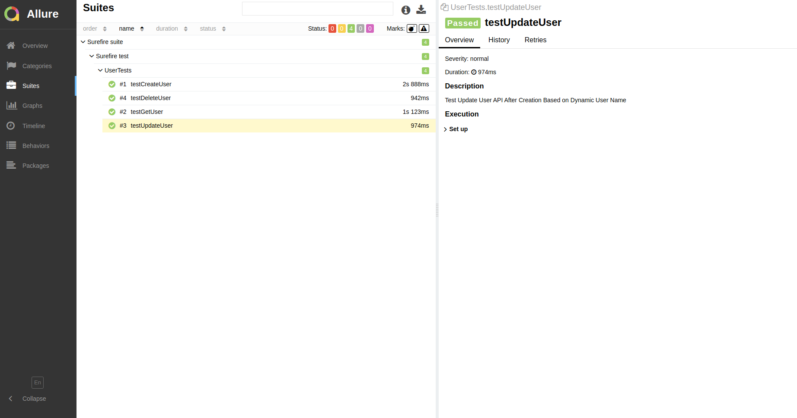

## Getting Started

### Prerequisites

The following software are required:

- Java JDK 11.
- IntelliJ.
- TestNG
- Maven.
- Allure

### Installation

1. Clone the repo using below URL

```sh
https://github.com/husseinhawary/rest-assured-demo.git
```

2. All project dependencies will be installed automatically from pom.xml file once you refresh it:


## Running local and show the report

1. Run local by clicking on testng.xml file and run it
2. OR you can run the tests by using this command
```
mvn clean test
```
3. Show the report
```
allure serve allure-results
```
4. This is allure report result


## Github Actions
The project integrated with github actions and you can see the runs build and rerun it from here
```
https://github.com/husseinhawary/rest-assured-demo/actions```

